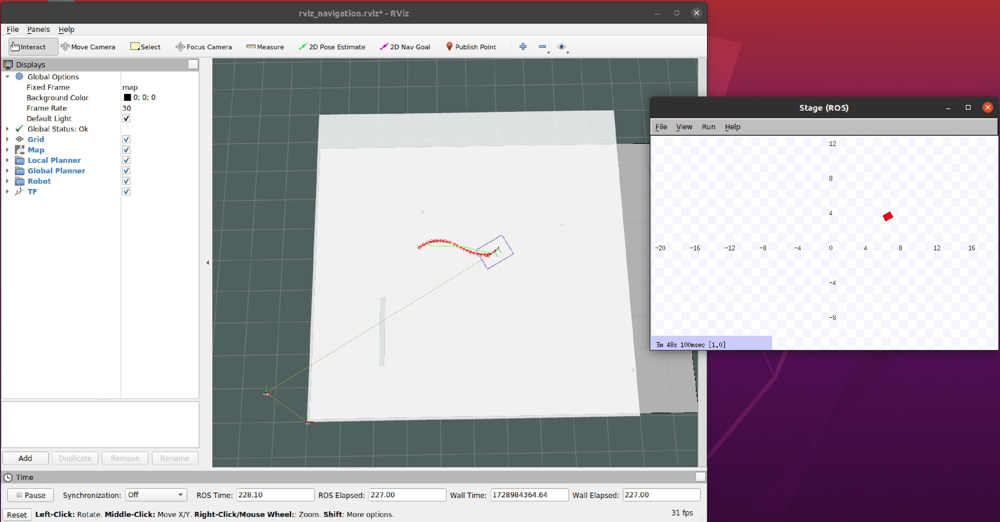
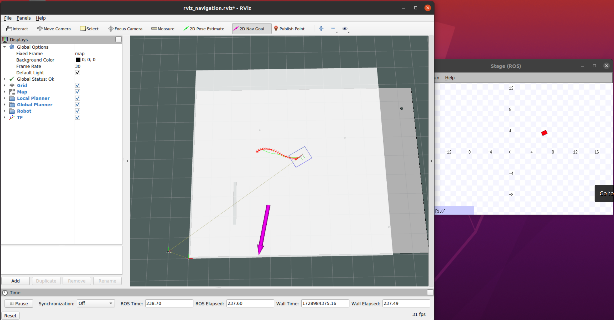
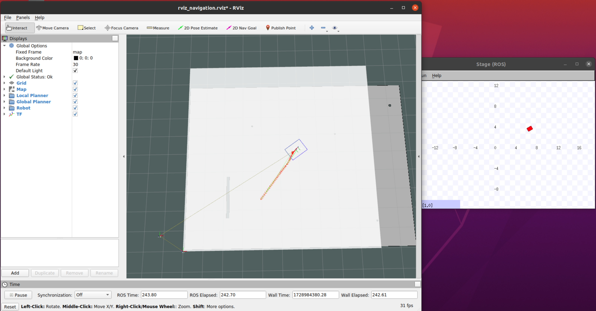

# Autonomous_Rover
Autonomous Software Stack for Rover functionality

-> This image shows a snap of the real-time visualisation of the rover in RViZ.  
-> The intense white map indicates the dynamic local costmap. 
-> The grey white map indicates the static global costmap. 
-> The grided open map is a SimTime environment named Stage ROS for emuluting the real world in 2-Dimension.
 
 

1) The first image is a snap of the bot navigating to some random goal. 

2) While in dynamism we randomly set a another goal state interactively. 

3) Now the path is replanned dynamically in real-time. 

4) The Bot starts moving towards the goal as the path is suggested. 

5) The bot reaches the goal state with some Goal Tolerance.

